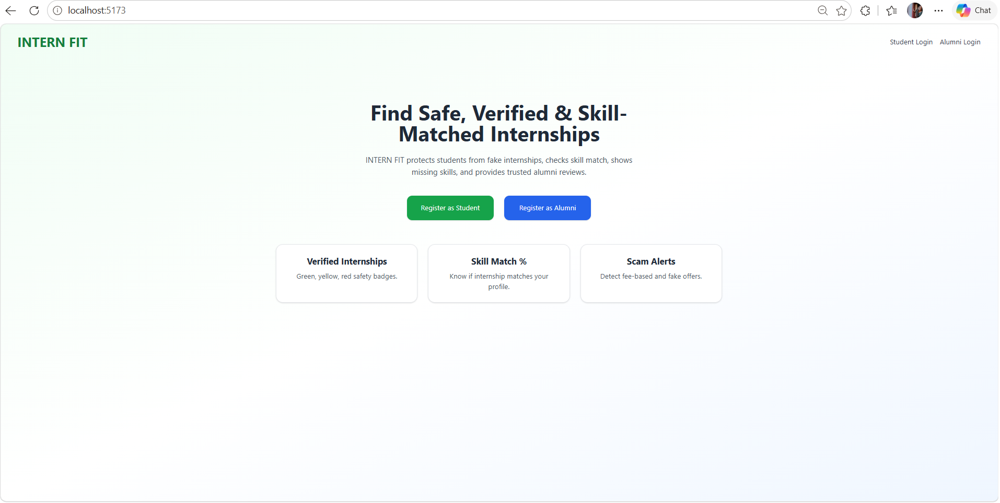
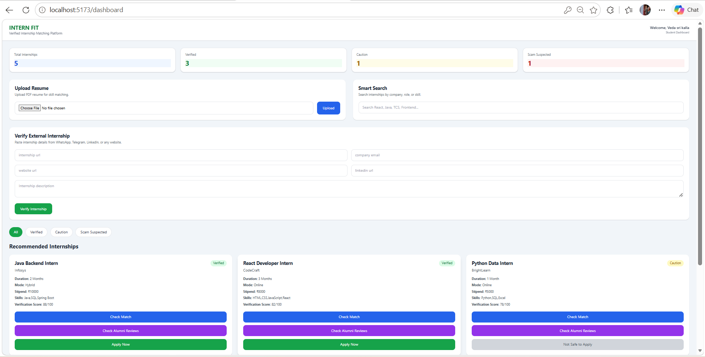
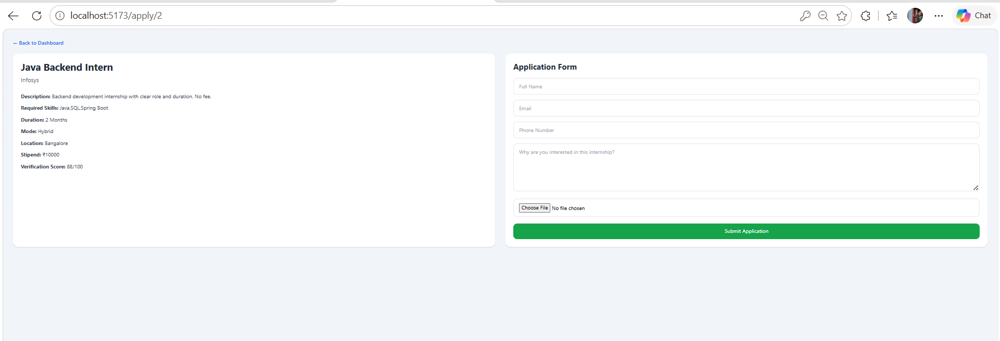
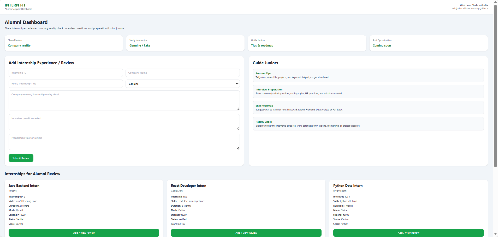

# INTERN FIT 🚀
### A Verified Internship Matching Platform for Students

INTERN FIT is a full-stack internship verification and matching platform designed to help students find safe, genuine, and skill-matched internships while avoiding scam opportunities commonly shared through WhatsApp, Telegram, Instagram, and unofficial websites.

The platform also connects alumni and juniors through real internship reviews, interview experiences, and preparation guidance.

---

# 📌 Problem Statement

Many students apply for internships without knowing:

- Whether the internship is genuine or fake
- Whether the role actually provides learning
- Whether the internship matches their skills
- What interview questions are asked
- What previous students experienced

This often leads to:
- Scam internships
- Wasted money and time
- Poor learning experience
- Fake certificates
- Skill mismatch

---

# 💡 Solution

INTERN FIT solves this problem using:

✅ Internship verification system  
✅ Resume-based skill matching  
✅ Scam detection logic  
✅ Alumni review system  
✅ External internship verification  
✅ Student–Alumni interaction platform  

---

# ✨ Features

## 👨‍🎓 Student Dashboard
- View verified internships
- Resume upload (PDF)
- AI-based skill extraction
- Match percentage calculation
- Skill gap analysis
- Apply for internships
- View alumni reviews
- Verify external internship links

---

## 👩‍💼 Alumni Dashboard
- Share internship experiences
- Review companies/internships
- Mark internships as genuine/fake
- Share interview questions
- Provide preparation tips
- Guide juniors with roadmap suggestions

---

## 🔐 Internship Verification System

Internships are classified into:

🟢 Verified  
🟡 Caution  
🔴 Scam Suspected  

Verification is based on:
- Official company email
- LinkedIn/company presence
- Website validity
- Scam keywords
- Payment detection
- Internship details completeness

---

# 🛠️ Tech Stack

## Frontend
- React.js
- Tailwind CSS
- Axios
- React Router DOM

## Backend
- Node.js
- Express.js

## Databases
- MySQL


## Other Tools
- Multer (resume upload)
- PDF parsing
- Git & GitHub

---

# 📂 Project Structure

```bash
InternFit/
│
├── frontend/
│   ├── src/
│   │   ├── pages/
│   │   ├── components/
│   │   ├── services/
│
├── backend/
│   ├── controllers/
│   ├── routes/
│   ├── uploads/
│   ├── server.js
│
└── README.md
```

---

# ⚙️ Installation & Setup

## 1️⃣ Clone Repository

```bash
git clone https://github.com/your-username/internfit.git
```

---

## 2️⃣ Frontend Setup

```bash
cd frontend
npm install
npm run dev
```

---

## 3️⃣ Backend Setup

```bash
cd backend
npm install
npm run dev
```

---

# 🗄️ Database Setup

## MySQL

Create database:

```sql
CREATE DATABASE internfit;
```

Import all required tables.

---


# 📸 Main Modules










## Student Features
- Internship browsing
- Match percentage
- Resume upload
- Alumni reviews
- Scam checker

## Alumni Features
- Internship reviews
- Interview guidance
- Preparation tips
- Internship verification support

---

# 🔄 Workflow

1. Student uploads resume
2. Skills are extracted
3. Internships are matched
4. Verification score is calculated
5. Alumni provide reviews
6. Students view reviews before applying

---

# 🎯 Future Enhancements

- AI chatbot integration
- Real-time notifications
- Company authentication
- Admin dashboard
- Internship recommendation engine
- Email verification
- Referral system

---

# 👩‍💻 Team Members

### Sahithi Achyutha Ishwarya Kalla
- Frontend & Backend Development
- Internship Verification Logic
- Student Dashboard
- Alumni Review Integration
- mySQL Integration
- Backend APIs
- Authentication & Database Management

---

# 📚 What We Learned

- Full Stack Development
- REST APIs
- Authentication
- Database Integration
- Resume Parsing
- React Component Architecture
- Internship Verification Logic
- Real-world Problem Solving

---

# 🌟 Why INTERN FIT Stands Out

Unlike normal internship portals, INTERN FIT focuses on:

✅ Internship safety  
✅ Scam prevention  
✅ Real alumni experiences  
✅ Skill matching  
✅ Student guidance  

It is designed specifically for college students and alumni collaboration.

---

# 📄 License

This project is developed for educational and academic purposes.

---

# ⭐ Support

If you like this project, give it a ⭐ on GitHub.